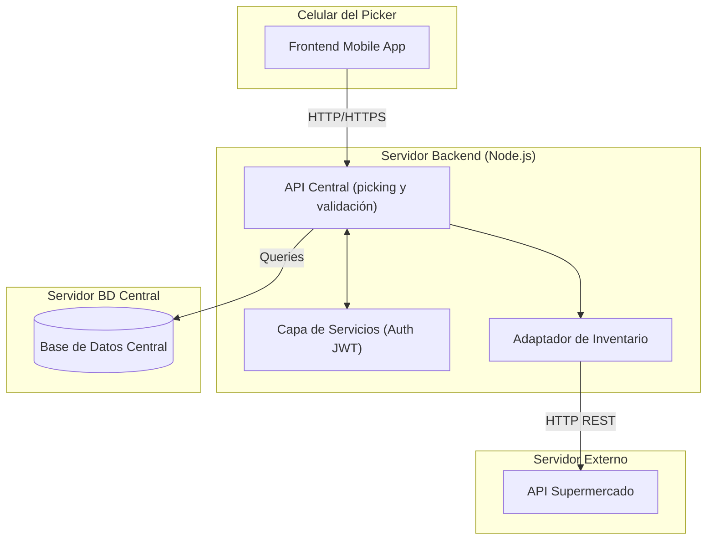
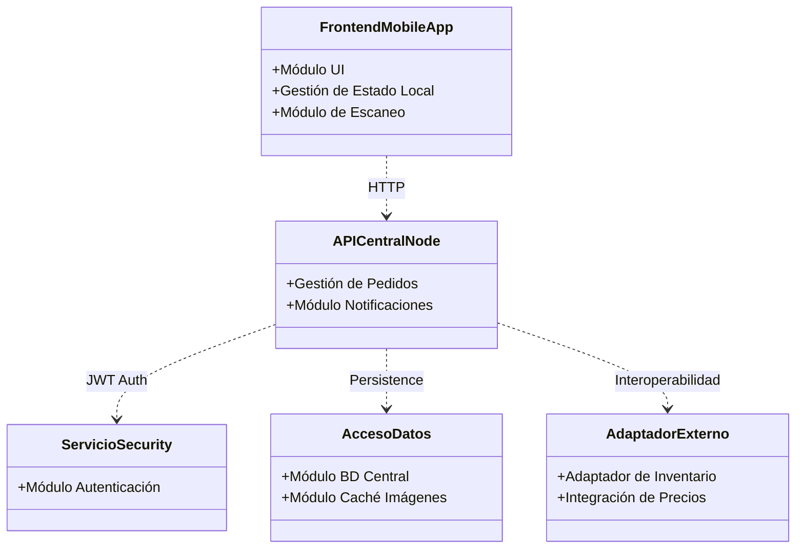
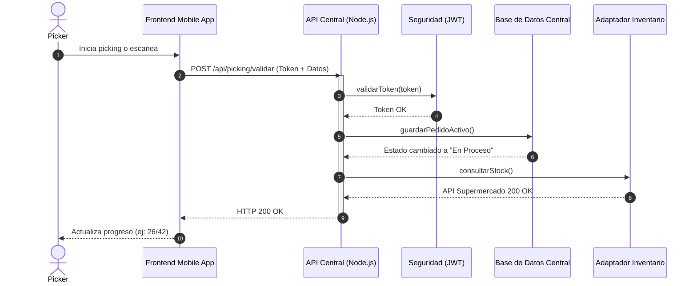

# Justificación estilo arquitectónico 
Elegimos el estilo REST/SOA porque la esencia de nuestro sistema es la interoperabilidad. Al ser una herramienta que depende de datos externos (pedidos y stock del supermercado), necesitamos una arquitectura basada en servicios que nos permita consumir y exponer información de manera estandarizada. Este estilo facilita la integración con el sistema del supermercado y permite que la aplicación del picker sea ligera, escalable y se comunique con el servidor de forma eficiente. Al elegir un estilo REST/SOA, sacrificamos autonomia de datos, ya que el sistema depende de la disponibilidad de las APIs del supermercado para funcionar.


## 🏗️ Módulos (Estilo REST/SOA)

Para **Zurtia**, los módulos se han estructurado siguiendo un estilo arquitectónico que separa las responsabilidades en capas, permitiendo escalabilidad y facilidad de mantenimiento.

### 1. Capa de Presentación (Frontend Mobile):
* **Módulo de Interfaz de Usuario (UI)**
    * **Responsabilidad:** Gestión de las pantallas de la App (basadas en diseño Figma), temas visuales y respuesta táctil.
    * **Objetivo:** Garantizar una experiencia de usuario fluida y adaptada al entorno de supermercado.
* **Módulo de Gestión de Estado local**
    * **Responsabilidad:** Control del contador de progreso (ej: 26/42) y persistencia de datos temporales del pedido activo.
    * **Impacto:** Permite que la app funcione de forma ágil sin depender de latencia de red constante.
* **Módulo de Escaneo**
    * **Responsabilidad:** Integración nativa con la cámara del dispositivo para la captura de códigos de barras.

### 2. Capa de Servicios de Aplicación:
* **Módulo de Autenticación y Autorización**
    * **Responsabilidad:** Validación de credenciales y generación de tokens **JWT**.
    * **Acceso:** Permite el inicio de sesión tanto con correos personales.
* **Módulo de Gestión de Pedidos**
    * **Responsabilidad:** Lógica de negocio principal; asignación de tareas a pickers y flujo de estados (Pendiente, En Proceso, Finalizado).
* **Módulo de Notificaciones**
    * **Responsabilidad:** Envío de alertas push para nuevos pedidos y avisos de quiebre de stock al perfil de gerente/repositor.

### 3. Capa de Interoperabilidad:
* **Adaptador de Inventario**
    * **Responsabilidad:** "Traductor" de comunicación con sistemas antiguos del supermercado para consulta de stock real y pasillos.
* **Módulo de Integración de Precios**
    * **Responsabilidad:** Servicio dedicado a recuperar valores unitarios, totales y aplicación de ofertas vigentes en tiempo real.

### 4. Capa de Datos y Persistencia
* **Módulo de Base de Datos Central (PostgreSQL)**
    * **Responsabilidad:** Almacenamiento persistente de perfiles, historial de pedidos, productos y cursos.
    * **Infraestructura:** La base de datos corre en un contenedor **Docker**, asegurando un entorno de desarrollo consistente y facilidad de despliegue.
    * **Implementación:** Se utiliza el driver `pg` (node-postgres) para gestionar una conexión asíncrona mediante un pool de conexiones, mejorando la concurrencia en comparación con la implementación anterior en SQLite.
* **Módulo de Caché de Imágenes**
    * **Responsabilidad:** Optimización de entrega de miniaturas (thumbnails) para minimizar el consumo de datos en la red del supermercado.

# -> Justificación de la Coherencia Arquitectónica:

* Independencia de Módulos: Si el sistema de precios del supermercado cambia, solo se modifica el Módulo de Integración de Precios, sin tocar la App móvil ni el sistema de login.

* Escalabilidad: Al ser REST, podemos tener a 100 pickers conectados simultáneamente, ya que cada petición es independiente y segura gracias al JWT.

* Resiliencia: El Módulo de Gestión de Estado local en la App permite que, si el servidor falla por un momento, el picker no pierda lo que ya escaneó.

---

## 🏗️ Modelado de Diseño (Diagramas)

Para complementar la arquitectura REST/SOA explicada arriba, ahora se presentan los diagramas lógicos y físicos del sistema.

### 1. Diagrama de Despliegue
Se conectan los componentes físicos y lógicos de la app y qué protocolos se usan en la red.



---

## 2. Diagrama de Componentes


---

## 3. Diagrama de Secuencia (Flujo Crítico de la HU)


```
