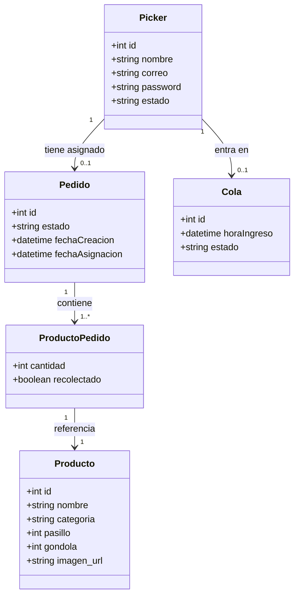
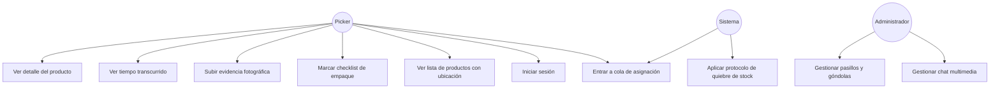
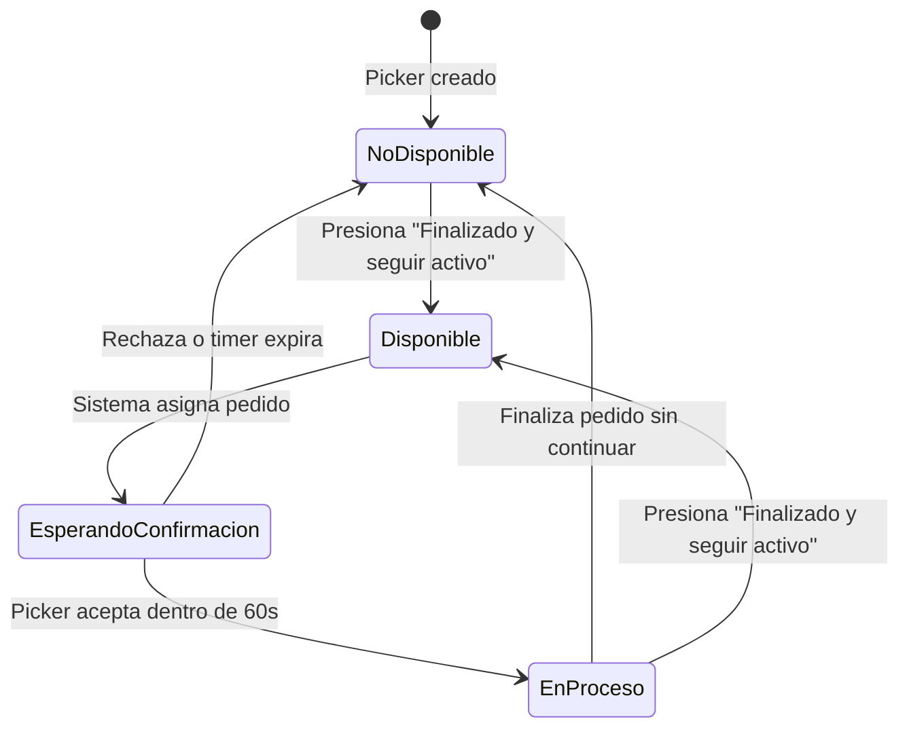

# 📐 Modelado de Análisis — Zurtia

---

## 1. Modelo de Dominio

```mermaid
classDiagram
    class Picker {
        +int id
        +string nombre
        +string correo
        +string password
        +string estado
    }

    class Pedido {
        +int id
        +string estado
        +datetime fechaCreacion
        +datetime fechaAsignacion
    }

    class ProductoPedido {
        +int cantidad
        +boolean recolectado
    }

    class Producto {
        +int id
        +string nombre
        +string categoria
        +int pasillo
        +int gondola
        +string imagen_url
    }

    class Cola {
        +int id
        +datetime horaIngreso
        +string estado
    }

    Picker "1" --> "0..1" Pedido : tiene asignado
    Picker "1" --> "0..1" Cola : entra en
    Pedido "1" --> "1..*" ProductoPedido : contiene
    ProductoPedido "1" --> "1" Producto : referencia
```

---

## 2. Diagrama de Casos de Uso

```mermaid
flowchart TD
    Picker((Picker))
    Admin((Administrador))
    Sistema((Sistema))

    Picker --> HU10[Iniciar sesión]
    Picker --> HU2[Entrar a cola de asignación]
    Picker --> HU8[Ver lista de productos con ubicación]
    Picker --> HU3[Marcar checklist de empaque]
    Picker --> HU4[Subir evidencia fotográfica]
    Picker --> HU7[Ver tiempo transcurrido]
    Picker --> HU9[Ver detalle del producto]

    Sistema --> HU2
    Sistema --> HU5[Aplicar protocolo de quiebre de stock]

    Admin --> HU1[Gestionar chat multimedia]
    Admin --> HU6[Gestionar pasillos y góndolas]
```

---

## 3. Diagrama de Estados — Entidad: Picker

```mermaid
stateDiagram-v2
    [*] --> NoDisponible : Picker creado

    NoDisponible --> Disponible : Presiona "Finalizado y seguir activo"
    Disponible --> EsperandoConfirmacion : Sistema asigna pedido
    EsperandoConfirmacion --> EnProceso : Picker acepta dentro de 60s
    EsperandoConfirmacion --> NoDisponible : Rechaza o timer expira
    EnProceso --> NoDisponible : Finaliza pedido sin continuar
    EnProceso --> Disponible : Presiona "Finalizado y seguir activo"
```
